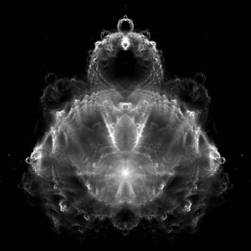
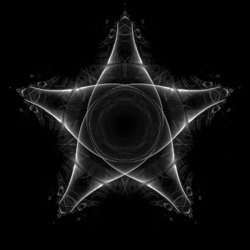
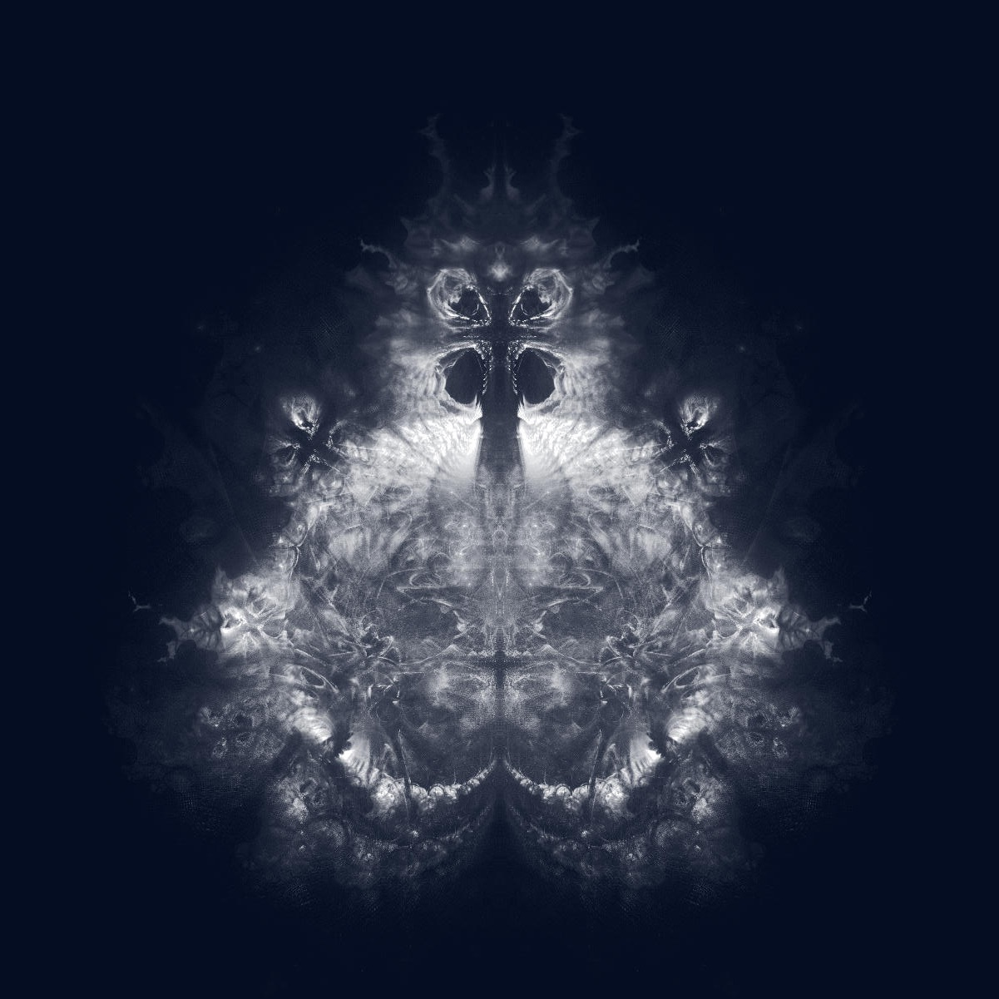
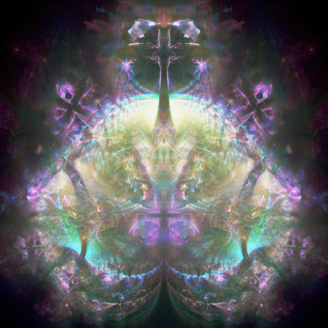

# WIP

# Rusty fractals

### Rust project to make fine fractal images & videos

## Nebula

When calculating fine fractals we are interested in all intermediate calculation results.  
All these intermediate results form a **calculation path**.

The program investigates at least one calculation path for each image pixel result.

All these **calculation paths together** are what makes the **Nebula fractal**.





## Nebula calculation

For each pixel `px`,`py`, take a point in the center: `re`,`im`, that is (calculation)  **origin** (`origin_re`, `origin_im`).

Start calculation below, and repeat it for maximum `iteration_max` times or until the calculation result
diverges.

> re = (re * re) - (im * im) + origin_re  
> im = 2 * re * im + origin_im

During the repeated calculation, point `re, im` jumps around in spirals,  
`origin_re` and `origin_im` are constant.

<br/>
In deliberately confusing terminology of complex numbers

> z = z<sup>2</sup> + c

Divergent calculation means that quadrance of values `re, im` is more then `CALCULATION_BOUNDARY = 4`

If that happens, continuing the calculation further would only increase values `re`, `im`
and wouldn't add any points to displayed image.

All the interesting points (origins) which seeded a successful calculation path are at the horizon of Mandelbrot set.

## Fractal projects

Head [README.md](fractal_head/README.md)  
Euler [README.md](fractal_euler/README.md)  
Lukas [README.md](fractal_lukas/README.md)  
Lotus [README.md](fractal_lotus/README.md)  
Mandelbrot [README.md](fractal_mandelbrot/README.md)    
Mandelbrot of Mandelbrot [README.md](fractal_mandelbrot_of_mandelbrot/README.md)  
Nebula [README.md](fractal_nebula/README.md)  
Nebula of Nebula [README.md](fractal_nebula_of_nebula/README.md)

## Classic image of Mandelbrot set

Count how many iteration it took, for the calculation to diverge.

Pixels, for which the calculation didn't diverge, that is `ITERATION_MAX` was reached, those color **black**.

Those pixels for which the calculation diverged after at least `ITERATION_min`, but before `ITERATION_MAX`
calculation iterations, those color with various **bright colors**.

## Image of Nebula, or any Fine Fractal


Calculation is the same, but we are interested in each point of the **calculation path**.

That is calculation `path`, represented as `Vec<[f64; 2]> path`

To make an image, for each path element `[re<sub>i</sub>, im<sub>i</sub>]` of `path` increase value of corresponding pixel by one.

Color the resulting values by **_decent colors_**.

It takes only seconds to generate decent image or video frame on good CPU.

Full zoom video or 10k resolution image may take 24h+

## Zoom video

All calculation paths are held in memory because as the zoom progresses,   
path elements `re<sub>i</sub>, im<sub>i</sub>` move to new screen pixels `xp, py`.

Path elements `re im` which move out of the image boundary are removed.



## Contributions are welcomed

```
git clone https://github.com/halzade/rusty_fractals.git
```

see [DEV.md](DEV.md) for issues.

## How to use

Try first **fractal_science** and play with some parameters.

## Random ideas to do

Make a fine fractal from Riemann Zeta function and zoom into -1/12
